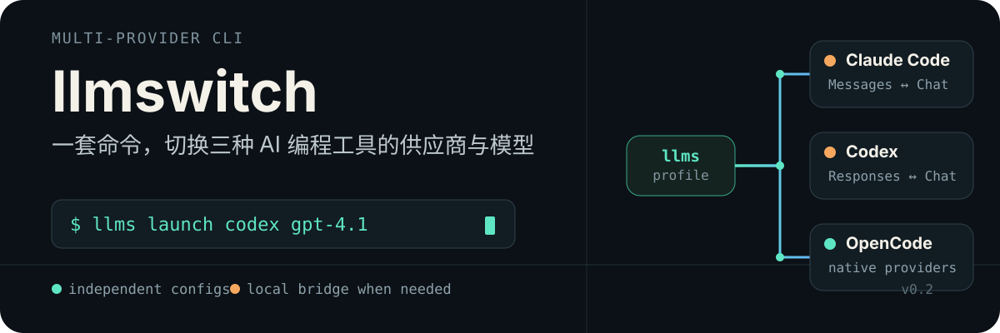

<p align="center">
  
</p>

<p align="center">
  <strong>Manage providers, models, proxies, and launch workflows for Claude Code, Codex, and OpenCode with one CLI.</strong>
</p>

<p align="center">
  <a href="./README.md">简体中文</a> · <strong>English</strong>
</p>

<p align="center">
  <a href="#quick-start">Quick Start</a> ·
  <a href="#compatibility">Compatibility</a> ·
  <a href="#command-reference">Command Reference</a> ·
  <a href="#configuration-and-security">Configuration & Security</a> ·
  <a href="./LICENSE">MIT License</a>
</p>

## What is llmswitch?

`llmswitch` is a local command-line tool for **Claude Code, Codex, and OpenCode**. It uses separate profiles to manage each tool's API endpoint, key, models, and proxy settings, then merges the selected profile into the tool's native configuration.

Native protocols connect directly. When Claude Code or Codex needs to access an upstream service that only supports OpenAI Chat Completions, `llmswitch` automatically starts a loopback-only bridge that translates common requests, responses, and SSE events.

```text
                            ┌─ Claude Code ── Anthropic Messages
provider profiles ─ llms ──┼─ Codex ──────── OpenAI Responses
                            └─ OpenCode ────── native providers
                                  │
                     local bridge when protocols differ
                                  │
                            OpenAI Chat API
```

## Features

- **One interface for three tools**: Manage Claude Code, Codex, and OpenCode through a consistent command structure.
- **Isolated configurations**: Each tool keeps its own profiles, default profile, and active profile, preventing provider settings from being mixed.
- **Switch and launch in one command**: Select a profile and model, update the configuration, and start the target CLI.
- **On-demand protocol translation**: Translate common text, tool call, tool result, and streaming events between Messages / Responses and Chat Completions.
- **Preserve existing configuration**: Merge only managed fields and create timestamped backups before changing existing target files.
- **Model discovery**: Attempt to retrieve models from the upstream `/models` endpoint, with manual model entry as a fallback.
- **Per-profile upstream proxies**: Configure HTTP, HTTPS, or ALL proxy settings independently for each profile.
- **Script-friendly output**: Query, switch, launch-plan, and bridge-status commands support JSON output.

## Quick Start

### Install

Requires Node.js 20+.

```bash
npm install -g @nvae/llmswitch
# or
bun add -g @nvae/llmswitch
```

After installation, use the `llms` (or `llm-switch`) command. For local development:

```bash
bun run src/index.ts --help
```

### 1. Add a provider

Create profiles independently for the tools you use:

```bash
llms claude provider
llms codex provider
llms opencode provider
```

The interactive interface lets you add, inspect, edit, delete, set as default, enable, and disable profiles. You can start from these templates:

| Template | Default API format | Default Base URL |
| --- | --- | --- |
| Custom (OpenAI-compatible) | Chat Completions | Enter manually |
| OpenAI | Responses | `https://api.openai.com/v1` |
| Anthropic | Messages | `https://api.anthropic.com` |

Other providers can be connected through a compatible OpenAI or Anthropic API endpoint. This does not mean that every provider, field, or protocol extension is fully supported.

### 2. Select models

```bash
llms codex model
# Select models for a specific profile
llms codex model --profile my-provider
```

When an API key is available, `llmswitch` attempts to retrieve the upstream model list. Use Space to select multiple models and Enter to confirm, then choose the default model. If the request fails or the upstream does not expose a compatible model endpoint, enter model IDs manually.

### 3. Enable a profile

```bash
llms codex use my-provider
llms codex current
```

`use` backs up the current target configuration, merges the new provider settings, and records the profile as active.

### 4. Switch models and launch

```bash
llms launch codex gpt-4.1

# Equivalent form
llms launch codex --model gpt-4.1

# Select a profile explicitly
llms launch claude --profile my-provider --model claude-sonnet-4

# run is an alias for launch
llms run opencode my-model
```

When `--profile` is omitted, profiles are selected in this order:

1. A profile whose model list contains the requested model;
2. The currently active profile;
3. The default profile.

Model matching ignores letter case and common separators. For example, `gpt4.1` can match `gpt-4.1`. If the requested model is not already in the profile, it is added to the model list and set as that profile's default model.

### 5. Preview or update configuration only

```bash
# Show the plan without changing configuration or launching the CLI
llms launch codex gpt-4.1 --dry-run

# Print the plan as JSON
llms launch codex gpt-4.1 --dry-run --json

# Update configuration without launching the target CLI
llms launch opencode my-model --print-only

# Pass additional arguments to the target CLI
llms launch opencode my-model -- --resume
```

If a target CLI is not on `PATH`, specify its executable:

```bash
export CLAUDE_BIN=/path/to/claude
export CODEX_BIN=/path/to/codex
export OPENCODE_BIN=/path/to/opencode
```

## Compatibility

| Target tool | Anthropic Messages | OpenAI Chat Completions | OpenAI Responses |
| --- | :---: | :---: | :---: |
| Claude Code | Direct | Via bridge | Unsupported |
| Codex | Unsupported | Via bridge | Direct |
| OpenCode | Direct | Direct | Direct |

OpenCode uses the corresponding AI SDK provider for each API format:

- Anthropic: `@ai-sdk/anthropic`
- OpenAI Responses: `@ai-sdk/openai`
- OpenAI Chat: `@ai-sdk/openai-compatible`

OpenAI-format Base URLs are normalized to end with exactly one `/v1`. Anthropic-format URLs only have trailing slashes removed. A custom gateway that does not use a `/v1` path may not work with the current OpenAI-format profiles.

## Local Bridge

Claude Code and Codex share one bridge process, but their upstream configurations remain isolated and may point to different providers. The bridge listens on `127.0.0.1:17890` by default:

```text
Claude Code  POST /v1/messages  ─┐
                                 ├─ local bridge ─→ POST /v1/chat/completions
Codex        POST /v1/responses ─┘
```

The bridge starts automatically when a profile requires it. Switching back to a native format removes that tool's bridge upstream. The process stops when neither tool requires the bridge.

Common management commands:

```bash
llms bridge status
llms bridge status --json
llms bridge start
llms bridge stop
llms bridge reload claude
llms bridge reload codex --profile my-provider

# Run in the foreground for troubleshooting
llms bridge serve
```

The bridge exposes these local endpoints:

| Method | Path | Purpose |
| --- | --- | --- |
| `GET` | `/health`, `/v1/health` | Inspect the service and upstream status |
| `GET` | `/models`, `/v1/models` | Merge model lists from configured upstreams |
| `POST` | `/messages`, `/v1/messages` | Anthropic Messages → Chat |
| `POST` | `/responses`, `/v1/responses` | OpenAI Responses → Chat/Completions |

```bash
curl http://127.0.0.1:17890/health
```

> [!WARNING]
> The bridge does not provide authentication, rate limiting, or request-body size limits. Keep the default loopback binding and do not use it as a public or multi-tenant production gateway.

## Upstream Proxies

When adding or editing a profile, you can configure:

- `HTTP_PROXY`
- `HTTPS_PROXY`
- `ALL_PROXY`, for example `socks5h://127.0.0.1:1080`

```bash
llms claude provider
# Choose Add or Edit, then enter the proxy settings
```

Native profiles merge the applicable proxy variables into the target tool's configuration. For bridge profiles, the bridge uses the proxy settings associated with the corresponding upstream. Actual behavior depends on the target CLI, the Node.js networking environment, and the proxy protocol, so verify it in your deployment environment.

## Command Reference

The common form is `llms <tool> <action>`, where `<tool>` is `claude`, `codex`, or `opencode`.

| Command | Description |
| --- | --- |
| `llms <tool> provider` | Interactively manage profiles; use `--json` to list them |
| `llms <tool> use [name]` | Enable an existing profile; supports `--json` |
| `llms <tool> current` | Show the default and active profiles; API keys are masked |
| `llms <tool> model [--profile name]` | Retrieve, select, and save models; supports `--json` |
| `llms launch\|run <tool> [model]` | Switch profile/model and launch the target CLI |
| `llms bridge status` | Show the bridge process and both upstream states |
| `llms bridge start\|stop` | Start or stop the bridge manually |
| `llms bridge reload [tool]` | Refresh one bridge upstream from the active or selected profile |
| `llms bridge serve` | Run the bridge in the foreground |
| `llms path` | Print the llmswitch data directory |

View all options:

```bash
llms --help
llms launch --help
llms bridge --help
llms codex --help
```

## Configuration and Security

### Configuration locations

| Data | Default location | Override |
| --- | --- | --- |
| llmswitch (macOS/Linux) | `~/.config/llm-switch/` | `LLM_SWITCH_HOME` or `XDG_CONFIG_HOME` |
| llmswitch (Windows) | `%APPDATA%\llm-switch\` | `LLM_SWITCH_HOME` |
| Claude Code | `~/.claude/settings.json` | `CLAUDE_CONFIG_DIR` |
| Codex | `~/.codex/config.toml`, `~/.codex/.env` | `CODEX_HOME` |
| OpenCode configuration | `~/.config/opencode/opencode.json` | `OPENCODE_CONFIG_DIR` or `XDG_CONFIG_HOME` |
| OpenCode authentication | `~/.local/share/opencode/auth.json` | `OPENCODE_DATA_DIR` or `XDG_DATA_HOME` |

For compatibility with the current application and existing configurations, the default llmswitch data path still uses the `llm-switch` directory name. On Windows, OpenCode authentication defaults to `%LOCALAPPDATA%\opencode\auth.json`. Print the active data directory with:

```bash
llms path
```

### Backup strategy

Before changing or disabling a configuration, existing target files are copied into the corresponding tool's `backups/` directory with timestamped filenames. A newly created file has no previous content to back up. Writes use a temporary file in the same directory followed by a rename, reducing the chance of leaving a partially written configuration.

### API keys

API keys are stored in **plaintext** in local profiles, target-tool authentication files, or bridge upstream configuration. llmswitch attempts to set newly written files to mode `0600`, but it does not use the operating system keychain or encrypt secrets.

Protect the configuration directories, never commit their contents to version control, and avoid storing long-lived keys on untrusted devices. JSON query output masks API keys, but files on disk still contain the actual values.

## Known Limitations

- The bridge is a protocol adapter for local use and does not guarantee complete semantic equivalence between the OpenAI and Anthropic protocols.
- Encrypted reasoning content in Responses is not forwarded, and unrecognized tool types may be ignored.
- Anthropic translation primarily covers text, tool calls, and tool results. Images and other non-text content may not be preserved completely.
- Codex Completions mode is a degraded fallback: the conversation is flattened into a prompt, so complex tool calls and agent workflows may not behave well.
- Codex Chat mode falls back to Completions only when the upstream returns HTTP `404` or `405`. Authentication, network, and other errors do not trigger fallback.
- Hosted `web_search` tools are translated into ordinary client-side functions and do not automatically gain hosted search capabilities from the upstream service.
- Automatic model discovery requires an API key and a compatible `/models` endpoint. Enter model IDs manually when discovery fails.

## Contributing

Issues and pull requests that improve configuration adapters, protocol translation, tests, or documentation are welcome.

When contributing a new provider or protocol adaptation, please include:

- The target tool and API format;
- Reproducible request and response behavior;
- Tests for both regular and streaming responses;
- Edge cases such as tool calls, tool results, and error responses.

## License

This project is available under the [MIT License](./LICENSE).
